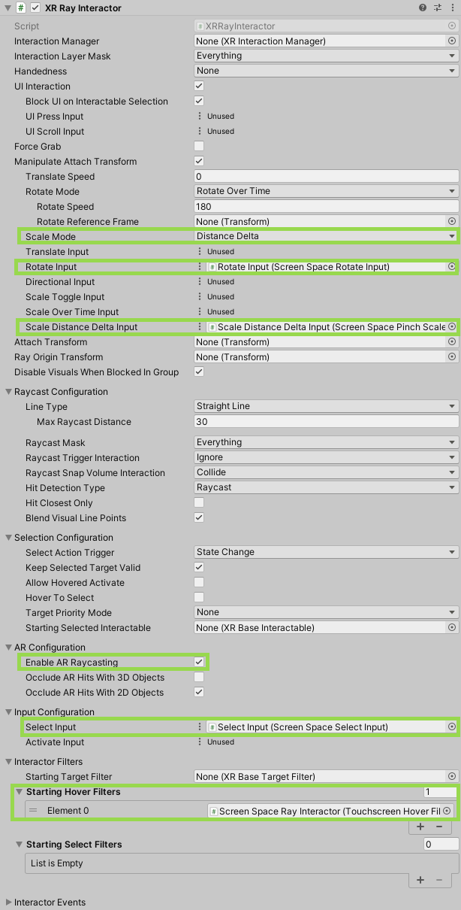
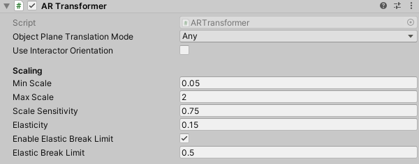

# AR Interaction Overview

This page provides a brief explanation for setting up a scene for mobile touchscreen AR and the related components.

> [!NOTE]
> AR interaction components are only available in a project that also includes the [AR Foundation](https://docs.unity3d.com/Manual/com.unity.xr.arfoundation.html) package. You can install the AR Foundation package via the [Package Manager](https://docs.unity3d.com/Manual/upm-ui-install.html).

## Touchscreen gestures

Touchscreen gesture data is surfaced by the `TouchscreenGestureInputController` which translates touch events into gestures such as tap, drag, pinch and twist. This gesture data can be used as bindings for [Input System](https://docs.unity3d.com/Manual/com.unity.inputsystem.html) actions.

The XR Interaction Toolkit package comes with a number of pre-defined gestures, but you can always extend this package by defining your own gestures.

| Gesture | Triggered by input |
|---|---|
| **Tap** | User touches the screen | 
| **Drag** | User drags finger across screen |
| **Pinch** | User moves two fingers toward or away from each other along a straight line | 
| **Twist** | User rotates two fingers around a center point | 
| **Two Finger Drag** | User drags with two fingers |

## Setting up for Touchscreen AR 

> [!NOTE]
> The [AR Starter Assets](samples-ar-starter-assets.md) sample contains an already configured input action map which can be used in place of creating one from scratch.

To set up a scene for Touchscreen AR you will want to create an Input Action Map with action bindings to the `TouchscreenGestureInputController` gesture data. (An action map asset can be created by right-clicking on the Assets folder and going to **Create** &gt; **Input Actions**.)

> [!NOTE]
> The AR Starter Assets sample contains a `Screen Space Ray Interactor` prefab, but if creating the GameObject from scratch, follow the instructions below.

Add a **Touchscreen Gesture Input Loader** to the scene. This will ensure that a `TouchscreenGestureInputController` device gets added automatically to the Input System so the bindings can resolve to the gestures.

Add an **XR Ray Interactor** component and enable **Enable AR Raycasting** to allow it to ray cast against the AR environment trackables, and also set **Scale Mode** to **Distance Delta**. Add a **Touchscreen Hover Filter** component and assign a reference to it on the XR Ray Interactor in its **Starting Hover Filters** property. This will make that interactor only hover interactables while the user is touching the screen.

Then add a **Screen Space Ray Pose Driver** component to the GameObject to allow the Transform component to be automatically updated based on the touch gestures on the screen.

To allow the XR Ray Interactor to respond to gesture inputs as expected, you will need to assign the inputs for **Rotate Input**, **Scale Distance Delta Input**, and **Select Input**. Click the More menu (`⋮`) button on each of the three input properties and set to **Object Reference**. Then add a **Screen Space Select Input** component, a **Screen Space Rotate Input** component, and a **Screen Space Pinch Scale Input** component and assign references to each.

Now that the XR Ray Interactor configuration is complete, connect the gesture input actions to the appropriate properties on the other added components. The application should now be ready to receive touchscreen input.

## AR Transformer

In order to have interactables like XR Grab Interactable adhere to the AR environment, adding an AR Transformer component is necessary. The AR Transformer allows objects to be moved and rotated only within the limits of the AR environment. Currently, only AR planes are supported.

## AR Starter Assets

A configured scene for touchscreen AR is available in the [AR Starter Assets](samples-ar-starter-assets.md) sample which is installable through the Samples tab under the XR Interaction Toolkit package in the Package Manager window.

This scene includes key mappings to simulate gestures in-editor. The following are keys to note:

- 'E' and 'R' rotate the object around the up axis.
- 'Z', 'X' and the scroll wheel scale the object up and down.
